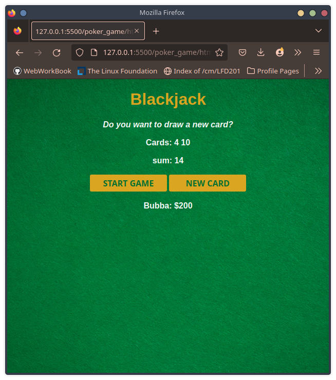

# Blackjack  Game - 

> Simple web-app Blackjack game written in JavaScript. This project is no longer maintained as of 2023.

The [Blackjack Application](elaborate-palmier-dc5f07.netlify.app/) generates random cards as requested by user. After user reaches "Blackjack" or 21, no more cards can be drawn.

Project completed as part of Scrimba's [Learn JavaScript for free](https://scrimba.com/learn/learnjavascript) course.

 

<figure></figure>

## Technologies Used

 

### Languages / Practiced Concepts

- HTML/CSS
- JavaScript
  - Arrays
  - Objects- linuxpip.org [How to change image size in Markdown](https://linuxpip.org/markdown-change-image-size/)
  - Booleans
  - If/else statements
  - Comparison operators
  - Logical operators
  - For loops
  - The Math object
  - Return statements

### Resources

- linuxpip.org [How to change image size in Markdown](https://linuxpip.org/markdown-change-image-size/)

- Simple Icons  [Markdown Images](https://simpleicons.org/)

- GitHub - hackergrrl [art-of-readme](https://github.com/hackergrrl/art-of-readme)

- GitHub - David Anson [markdownlint](https://github.com/DavidAnson/markdownlint/blob/main/doc/Rules.md#md033)

 

## To-do

- Have 'start game' Button change to "restart game" after being clicked
- Create function to allow for a win-senario by adding in dealers hand and a "win" display
- Adjust CSS styling to allow for a more blackjack table-like experience
- Correct formatting of citation for hackergrrl in resource above

 

## License

Poker game application created as part of the JavaScript class with [Scrimba](https://scrimba.com/)
